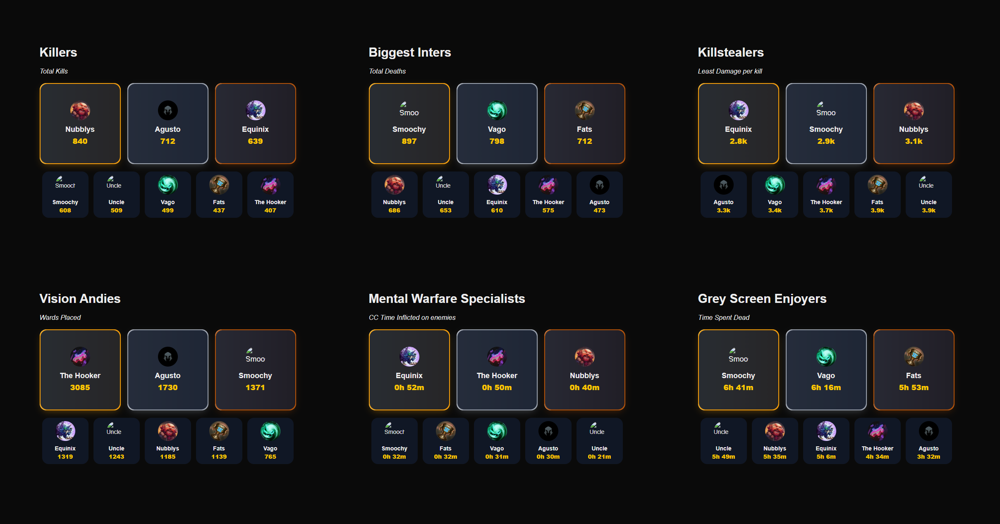

# lolbois-stats

A Next.js stat-tracking site for a group of League of Legends players. It pulls match data from the Riot Games API, crunches it into leaderboard categories, and renders them as ranked stat cards.



## Categories

Players are ranked (top 3 medaled, rest listed) across categories such as:

- **Killers** — most kills
- **Biggest Inters** — most deaths
- **Killstealers** — kill participation shenanigans
- **Vision Andies** — vision score
- **Mental Warfare** — chat/pings stats
- **Grey Screen Enjoyers** — most deaths without a kill/assist
- **Fav Item** — most purchased item

Category definitions live in [`lib/categories.js`](lib/categories.js) and [`lib/utils.js`](lib/utils.js).

## Getting Started

```bash
npm install
npm run dev
```

Open [http://localhost:3000](http://localhost:3000) to see the result.

### Environment variables

Create a `.env` with:

```
RIOT_API_KEY=your-riot-api-key
```

### Data pipeline

The site reads from static JSON in `data/`, generated ahead of time rather than fetched live:

```bash
npm run gen-players       # fetches player match data from Riot -> data/players.full.json
npm run gen-recent-match  # fetches a single recent match, for debugging
```

`data/players.json` is the input roster; `scripts/buildPlayers.js` enriches it via the Riot API into `data/players.full.json`, which the app imports directly at build time.

## Tech stack

- [Next.js](https://nextjs.org) (App Router, Turbopack)
- [Tailwind CSS](https://tailwindcss.com) v4
- [MUI](https://mui.com) / Emotion
- [Framer Motion](https://www.framer.com/motion/)
